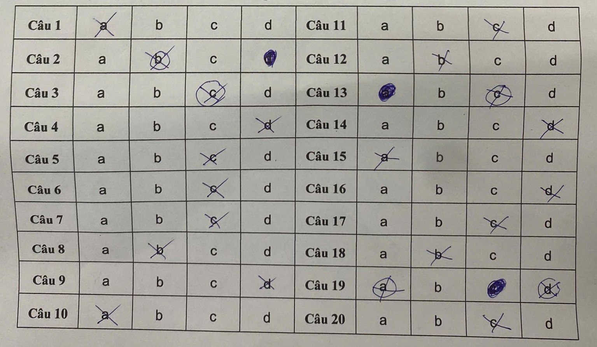

# **Automated OMR Test Scoring System using Image Processing**

This project is an application built with Python and OpenCV to automate the process of grading multiple-choice answer sheets. The system can analyze a scanned image or photograph of an answer sheet, identify the marked bubbles, and extract the results quickly and accurately.

## **Demo**

The system is capable of processing multi-column answer sheets like the one below:



## **Key Features**

- **Automatic Sheet Detection:** Automatically finds and isolates the answer sheet from any background in an image.
- **Perspective & Skew Correction:** Applies a Perspective Transform to "flatten" the answer sheet, removing any skew or distortion from the scanning or capturing process.
- **Mark Recognition:** Segments the answer bubbles, applies binary thresholding, and analyzes pixel density to accurately determine the option selected by the student.
- **Multi-Column Support:** Capable of processing layouts with two columns of questions (e.g., questions 1-10 and 11-20).
- **Result Extraction:** Outputs a final list of the student's answers in character format (A, B, C, D) for easy review and grading.

## **Technologies Used**

- **Language:** Python
- **Libraries:**
    - **OpenCV:** Used for core image processing tasks.
    - **NumPy:** Used for high-performance array manipulation.
    - **imutils:** Provides convenience functions for image processing.
    - **Jupyter Notebook:** The development environment for this project.

## **Setup and Usage (with Anaconda)**

1.  **Clone the repository:**
    ```bash
    git clone [YOUR_REPOSITORY_URL]
    cd [YOUR_PROJECT_DIRECTORY]
    ```

2.  **Create and activate an Anaconda environment:**
    Open Anaconda Prompt (or Terminal) and run the following commands. This creates a separate environment to manage dependencies independently.
    ```bash
    # Create a new environment named 'omr_project' with Python 3.9
    conda create --name omr_project python=3.9 -y

    # Activate the environment
    conda activate omr_project
    ```
    *Note: Adding `-y` to the `create` command automatically confirms the setup steps.*

3.  **Install the required libraries:**
    Once the environment is active `(omr_project)`, run the following command:
    ```bash
    pip install opencv-python numpy imutils matplotlib jupyter
    ```

4.  **Run the project:**
    Use the `cd` command to navigate to your project directory, then launch Jupyter:
    ```bash
    # Example: cd Documents/OMR_Project
    jupyter notebook
    ```
    A new tab will open in your browser. Click on the `.ipynb` file to open and run the code.

5.  **Check the image path:**
    Open the notebook and ensure the `path = "..."` line points to the correct image file within the project directory.

## **Technical Workflow**

1.  **Preprocessing:** The input image is converted to grayscale and blurred using a Gaussian filter.
2.  **Sheet Finding:** The Canny algorithm and `findContours` are used to find the outline of the answer sheet.
3.  **Rectification:** `warpPerspective` is used to create a flat, top-down view of the sheet.
4.  **Segmentation & Recognition:**
    - The sheet is split into columns and answer bubbles using `vsplit` and `hsplit`.
    - Otsu's Thresholding is applied to binarize the image.
    - `countNonZero` and `np.amax` are used to find the bubble with the most marked pixels.
5.  **Output:** The index of the selected answer is mapped to its corresponding character (A, B, C, D).

## **Potential Improvements**

- **Automated Grading:** Integrate a feature to compare the recognized answers against a predefined answer key to automatically calculate the final score.
- **Student Information Recognition:** Use OCR (e.g., Tesseract) to read the Student ID.
- **GUI Implementation:** Build a graphical user interface to allow users to easily upload images and view results.
